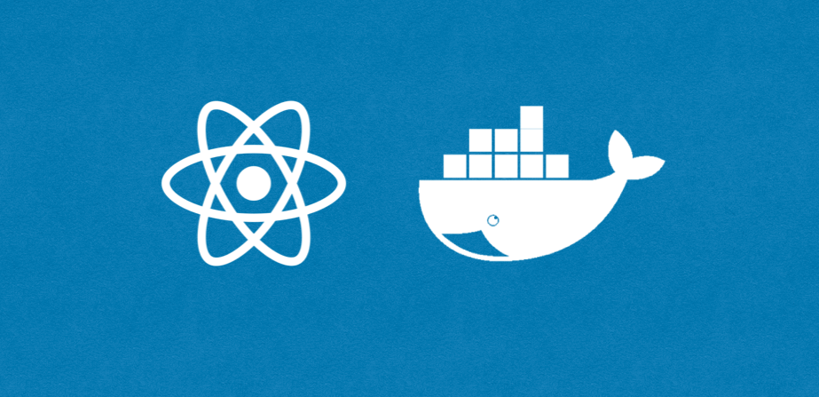

<h1 align="center">
<br>
RECKO - React + Docker + Makefile
<br>

<br>
</h1>


<h3 align="center">A React App of a dockerized React with Makefile including options for DEV and PROD </h3>

# Getting Started

These instructions will cover usage information and for the docker container:

## Prerequisities


In order to run this container you'll need docker installed.

* [Windows](https://docs.docker.com/windows/started)
* [OS X](https://docs.docker.com/mac/started/)
* [Linux](https://docs.docker.com/linux/started/)

## Install

First of all, you will need to fork and clone the repository.

After it, you should do a make build, and after that a make dev.

DONE! Next thing is to program your amazing website with React.

[!] With make dev docker is used with hot reload, just save your changes and look at localhost:3005

## Usage

### Makefile Parameters

List the different parameters available to your container:


#### Build your container:
```shell
make build
```

#### Build, (re)creates, starts, and attaches to containers for a service. It has a hot reload, so you can program as the same time as you see the changes:
```shell
make dev
```

#### Stop your container and remove it to prevent problems:
```shell
make devstop
```

# Built With

* Docker version 20.10.5, build 55c4c88
* docker-compose version 1.28.5, build c4eb3a1f
* create-react-app 3.4.1
* GNU Make 4.2.1

# Author ✒️

* **Marcos Rodríguez** - *Progamming and Documentation* - [Github](https://github.com/mark-doblefilo) - [Twitter](https://twitter.com/mark_doblefilo) - [Linkedin](https://www.linkedin.com/in/marcos-rodr%C3%ADguez-8b1441195/)
